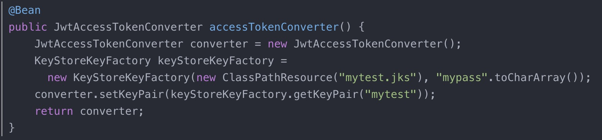
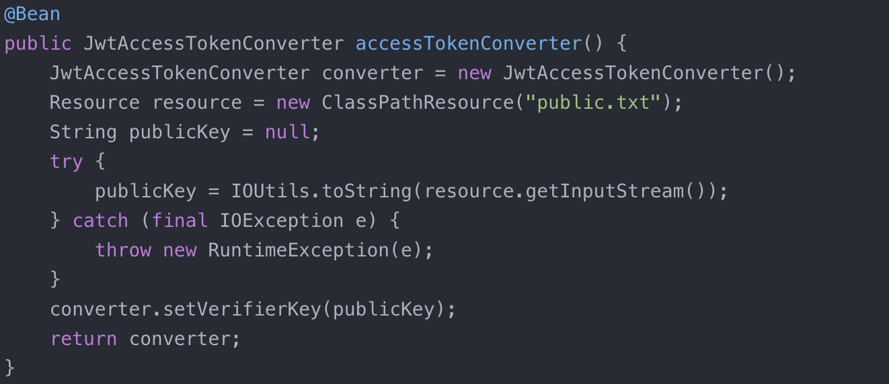

1、生成JKS Java KeyStore文件
keytool -genkeypair -alias mytest -keyalg RSA 
        -keypass mypass -keystore mytest.jks -storepass mypass

确保keypass和storepass一样    

2、导出公钥
keytool -list -rfc --keystore mytest.jks | openssl x509 -inform pem -pubkey

3、复制公钥到src/main/resources/public.txt中

4、授权服务器

5、资源服务器

